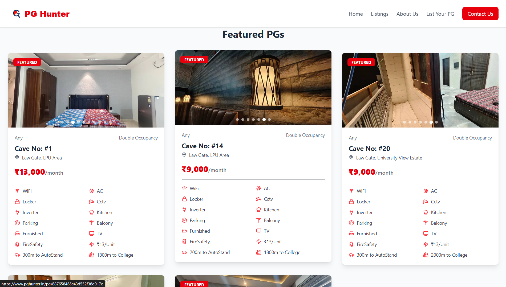
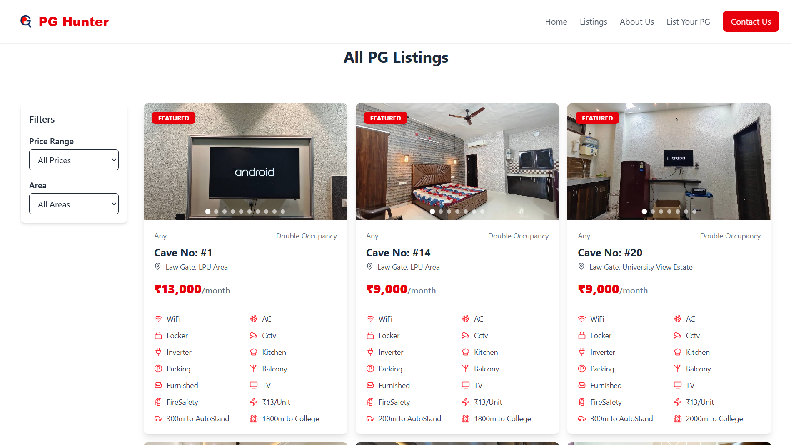

# 🏠 PGHunter.in  

[](https://www.pghunter.in/)  
[](https://reactjs.org/)  
[](./LICENSE)  

**PGHunter.in** is a modern **PG accommodation discovery platform** built with **React.js**.  
It helps users **search, explore, and book** PGs with ease — offering detailed listings, filters, and rich PG detail pages.  

---

## ✨ Features  

✅ **Beautiful Landing Page** – Showcasing PGHunter’s services.  
✅ **PG Listings Page** – Browse all available PG accommodations.  
✅ **Smart Search Results** – Filtered results for quick discovery.  
✅ **PG Details Page** – Rich details with amenities, pricing, and facilities.  
✅ **Static Pages** – About Us & Contact Us for company info and support.  
✅ **Authentication** – Modal-based login system.  
✅ **Smooth Navigation** – Auto scroll-to-top on route change.  
✅ **Interactive Carousels** – Powered by [Slick Carousel](https://kenwheeler.github.io/slick/).  

---

## 🛠 Tech Stack  

- **Frontend:** React.js (with React Router v6)  
- **Styling:** CSS, Slick Carousel  
- **Routing:** React Router DOM  
- **UI Components:** Header, Footer, Login Modal, ScrollToTop  
- **Deployment:** Vercel / Netlify  

---

## 📂 Project Structure  

```
pghunter.in/
│── src/
│   ├── components/        # Reusable components
│   │   ├── Header.jsx
│   │   ├── Footer.jsx
│   │   ├── LoginModal.jsx
│   │   ├── ScrollToTop.jsx
│   │
│   ├── pages/             # Page-level components
│   │   ├── Homepage.jsx
│   │   ├── ListingsPage.jsx
│   │   ├── SearchResults.jsx
│   │   ├── PGDetails.jsx
│   │   ├── AboutPage.jsx
│   │   ├── ContactUsPage.jsx
│   │
│   ├── App.js             # App entry (Routes defined here)
│   ├── index.js           # React DOM rendering
│
├── public/
│   ├── index.html
│   ├── homePage.png       # Screenshots
│   ├── featuredPage.png
│   ├── allPgPage.png
│
├── package.json
└── README.md
```

---

## ⚡ Getting Started  

### 1️⃣ Clone the Repository  
```bash
git clone https://github.com/your-username/pghunter.in.git
cd pghunter.in
```

### 2️⃣ Install Dependencies  
```bash
npm install
```

### 3️⃣ Run the Development Server  
```bash
npm start
```

The app will be live on → **http://localhost:3000/** 🎉  

---

## 📸 Screenshots  

### 🏡 Home Page  
  

### ⭐ Featured PGs  
  

### 📋 All PG Listings  
  

---

## 🌐 Deployment  

PGHunter.in can be deployed on:  

- 🔹 **Vercel** → [Deployment Guide](https://vercel.com/docs)  
- 🔹 **Netlify** → [Deployment Guide](https://docs.netlify.com/)  

Build the app before deployment:  
```bash
npm run build
```

---

## 👨‍💻 Authors  

Developed with ❤️ by  

- **Tanmoy Debnath**  
  - 📧 Email: [tanmoy.code@gmail.com]  
  - 🔗 Portfolio:[www.tanmoy.codes] / LinkedIn: [https://www.linkedin.com/in/tanmoy-dev/]  

- **Rohit Kumar**  
  - 📧 Email: [rohitranjanrrsingh@gmail.com]  
  - 🔗 Portfolio:[https://portfolio-rohit-kumars-projects-4484f538.vercel.app/] / LinkedIn: [https://www.linkedin.com/in/rohit-kumar111/]   

---

## 📜 License  

This project is licensed under the **MIT License**.  
Feel free to **use, modify, and distribute** with attribution.  

---
